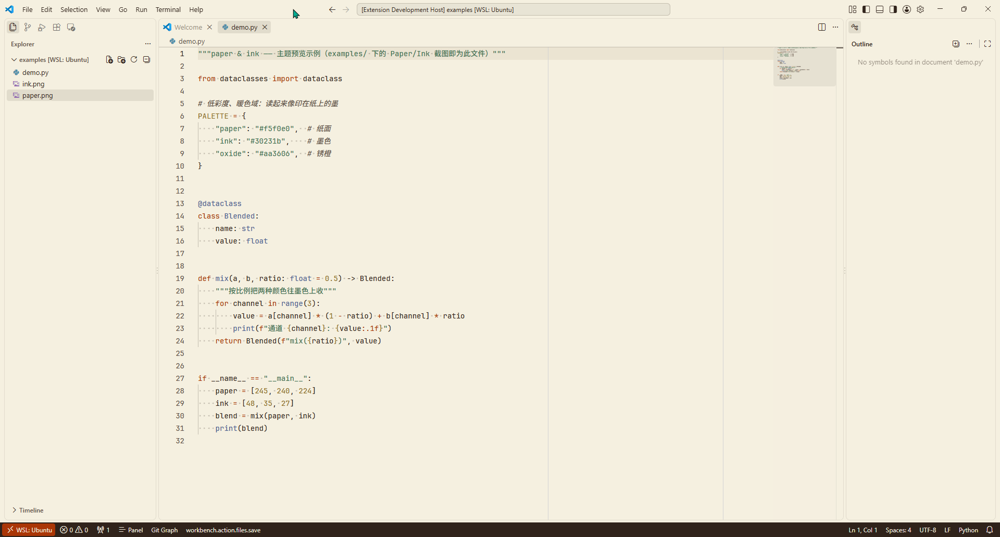
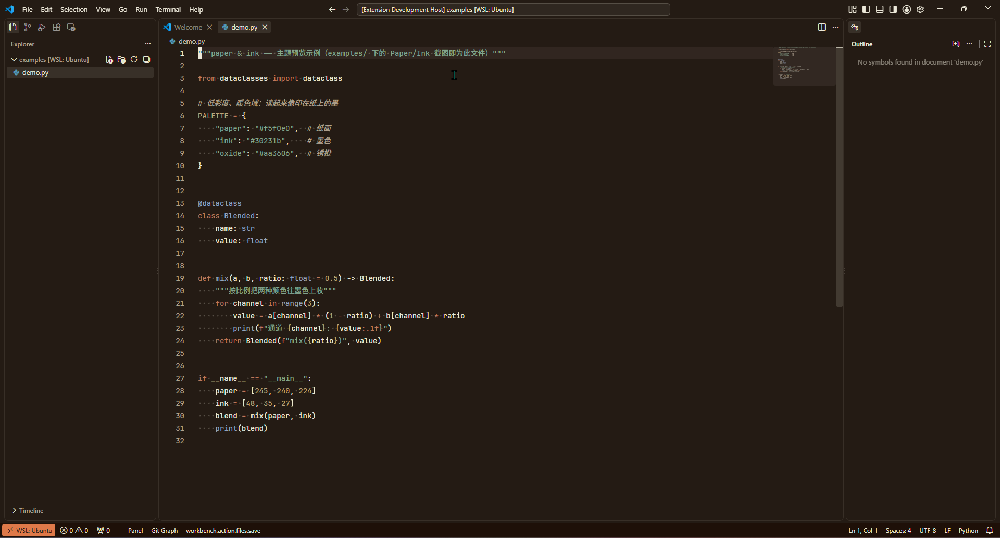

# Paper & Ink

一对极简的 VS Code 配色主题，取自 [webwithoutjs.com/lab/paper-ink](https://webwithoutjs.com/lab/paper-ink/) 的纸墨配色：

- **Paper**（浅色）—— 暖米白纸面 + 墨色文字 + 铁锈橙点缀
- **Ink**（深色）—— 整个页面倒过来：暖炭黑"墨"底 + 纸色文字 + 陶土橙点缀

## 预览

**Paper（浅色）**



**Ink（深色）**



## 使用

### 方式一：开发宿主预览（F5）

用 VS Code 打开本目录，按 <kbd>F5</kbd> 启动扩展开发宿主，
在新窗口里 <kbd>Ctrl</kbd>+<kbd>K</kbd> <kbd>Ctrl</kbd>+<kbd>T</kbd> 选择 **Paper** 或 **Ink**。

### 方式二：打包安装

```bash
npx @vscode/vsce package          # 生成 paper-ink-0.1.0.vsix
code --install-extension paper-ink-0.1.0.vsix
```

## 重新生成主题

所有颜色集中在 `scripts/generate-theme.mjs` 顶部的 OKLCH 定义里，改完重跑即可：

```bash
node scripts/generate-theme.mjs
```

## License

MIT
